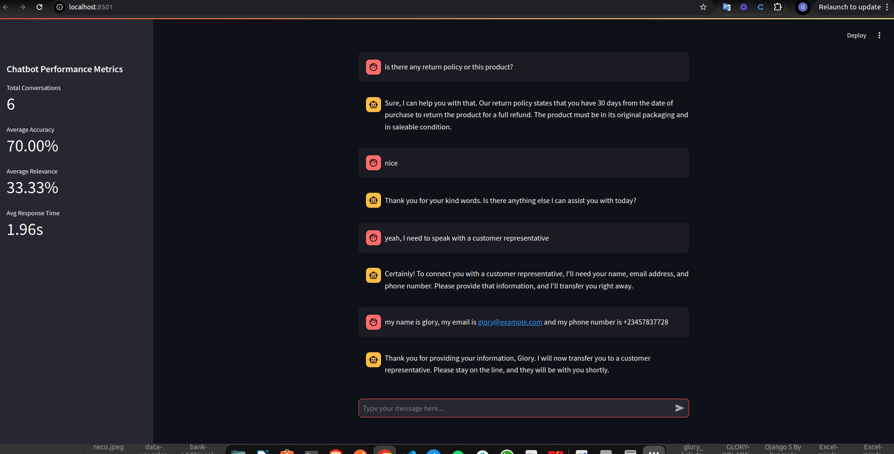
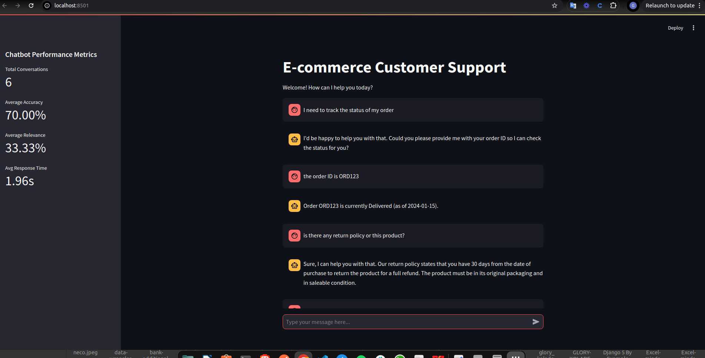

# E-commerce Support Chatbot

A customer service chatbot built with LangChain and Google's Gemini, designed to handle e-commerce support queries through a Streamlit interface.

## Overview

his project is a Streamlit-based chatbot designed to assist users with inquiries about their orders and return policies in an e-commerce context. It leverages Google Generative AI (Gemini) for natural language processing and provides real-time conversational support.




## Features

- Real-time order status tracking
- Natural language processing for customer queries
- Conversation memory and context management
- Customer contact information handling
- Streamlit-based web interface
- Natural Conversations: Handles general inquiries with polite, professional responses.
- Persistent Chat History: Maintains the context of the conversation for better interaction.
- Configurable API Key: Allows secure integration of Google Generative AI.


## Project Structure

ECOM-BOT/
│
├── chat.py   # this is the main file to run the application
|-- evaluator.py    #contains the evaluator class that evaluates the model based on it's responses(used in the chat.py file)
|-- ecom_support.py   # contains the main project class used by the chat.py
├── requirements.txt       # project dependencies
├── README.md              # Project documentation       
├── .streamlit/secrets.toml                #cthis is where you place your Gemini API key
└── screenshots      # a folder containing scressnshots of the application durng testing


## Installation

1. Clone the repository:
```bash
git clone https://github.com/GloryKO/EcomSupportBot.git
cd ECOM-BOT
```

2. Create a virtual environment:
```bash
python -m venv env
source venv/bin/activate  # On Windows: venv\Scripts\activate
```

3. Install dependencies:
```bash
pip install -r requirements.txt
```

4. Set up environment variables:
```place your API key in .streamlit/secrets.toml
```

## Dependencies

```
langchain==0.1.0
google-generativeai==0.3.0
streamlit==1.30.0
python-dotenv==1.0.0
pandas==2.1.4
pydantic==2.5.3
```

## Development Roadmap

### Phase 1: Core Bot Development
- Project structure setup
- Basic bot functionality implementation
- Gemini API integration
- Conversation handling development

### Phase 2: Data Integration
- Order  mock database implementation
- Data access layer creation

### Phase 3: UI Development
- Streamlit interface construction
- Chat UI implementation

### Phase 4: Testing and Refinement

- User acceptance testing

## Usage

Start the Streamlit interface:
```bash
streamlit run chat.py
```

The chatbot will be available at `http://localhost:8501`

## Usage

1. **Enter your query**: Type a question or a prompt into the text input field.
2. **Submit the query**: Click the "enter" button or click on the send icon to send the query.
3. **View the response**: The application will display a response generated by the language model.

## Examples
- Scenario 1: Order Status Check
User: "I want to track the status of my order"

- Scenario 2: Return Policy Inquiry

User: "What is the return policy for items purchased at your store?"

- Scenario 3: Human Representative Request

User: "nice. can I speak with a human representative?"


## Contributing

1. Fork the repository
2. Create a feature branch
3. Commit your changes
4. Push to the branch
5. Create a Pull Request

## License

This project is licensed under the MIT License - see the LICENSE file for details.